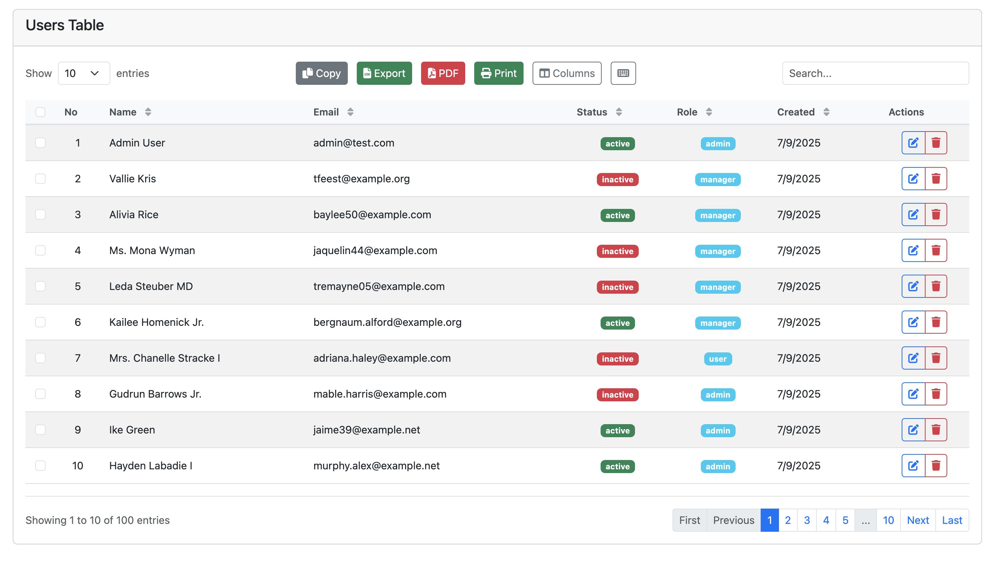
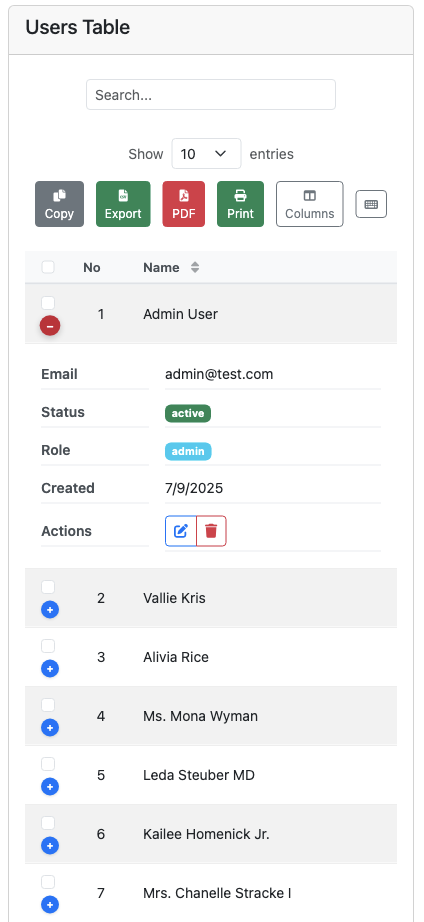

# ModernTable.js

[](https://www.npmjs.com/package/modern-table-js)
[](https://opensource.org/licenses/MIT)
[](https://bundlephobia.com/package/modern-table-js)
[](https://www.npmjs.com/package/modern-table-js)
[](https://github.com/agustra/modern-table-js)

Modern, lightweight, vanilla JavaScript table library with **zero dependencies**. DataTables-compatible API with mobile-first responsive design.

## 📸 Screenshots

### Desktop View (Bootstrap + Font Awesome)


### Mobile Responsive


### Export Functionality


*More screenshots available in [SCREENSHOTS.md](./SCREENSHOTS.md)*

## ✨ Features

- 🚀 **Zero Dependencies** - Pure vanilla JavaScript
- 📱 **Mobile First** - Smart responsive design
- ⚡ **High Performance** - Optimized for large datasets
- 🎨 **Modern UI** - Beautiful default styling
- 🔌 **Plugin System** - Extensible architecture
- 🌙 **Dark Mode** - Built-in theme support
- ⌨️ **Keyboard Navigation** - Full accessibility
- 📊 **Server-side Processing** - Laravel/PHP ready
- 🎯 **DataTables Compatible** - Easy migration

## 🚀 Quick Start

### CDN
```html
<!-- Option 1: With Bootstrap + Font Awesome (Recommended) -->
<link href="https://cdn.jsdelivr.net/npm/bootstrap@5.3.0/dist/css/bootstrap.min.css" rel="stylesheet">
<link href="https://cdnjs.cloudflare.com/ajax/libs/font-awesome/6.0.0/css/all.min.css" rel="stylesheet">
<link href="https://cdn.jsdelivr.net/npm/modern-table-js@1.0.3/modern-table.css" rel="stylesheet">
<link href="https://cdn.jsdelivr.net/npm/modern-table-js@1.0.3/responsive.css" rel="stylesheet">

<!-- Option 2: Standalone (Zero Dependencies) -->
<link href="https://cdn.jsdelivr.net/npm/modern-table-js@1.0.3/modern-table.css" rel="stylesheet">
<link href="https://cdn.jsdelivr.net/npm/modern-table-js@1.0.3/responsive.css" rel="stylesheet">

<!-- JavaScript -->
<script type="module" src="https://cdn.jsdelivr.net/npm/modern-table-js@1.0.3/core/ModernTable.js"></script>
```

### NPM
```bash
npm install modern-table-js
```

### Basic Usage

#### Server-side (API)
```javascript
import { ModernTable } from 'modern-table-js';

const table = new ModernTable('#myTable', {
    api: '/api/users',                    // Server-side data
    columns: [
        { data: 'name', title: 'Name' },
        { data: 'email', title: 'Email' },
        { data: 'status', title: 'Status' }
    ],
    responsive: true,
    select: true,
    buttons: ['copy', 'csv', 'excel']
});
```

#### Client-side (Static Data)
```javascript
const users = [
    { name: 'John Doe', email: 'john@example.com', status: 'active' },
    { name: 'Jane Smith', email: 'jane@example.com', status: 'inactive' }
];

const table = new ModernTable('#myTable', {
    data: users,                          // Client-side data
    columns: [
        { data: 'name', title: 'Name' },
        { data: 'email', title: 'Email' },
        { data: 'status', title: 'Status' }
    ],
    responsive: true,
    select: true,
    buttons: ['copy', 'csv', 'excel']
});
```

## 📖 Documentation

### Core Options
```javascript
const table = new ModernTable('#table', {
    // Data source
    api: '/api/data',
    
    // Columns configuration
    columns: [
        { data: 'name', title: 'Name', orderable: true },
        { data: 'email', title: 'Email' },
        { 
            data: 'status', 
            title: 'Status',
            render: (data) => `<span class="badge">${data}</span>`
        }
    ],
    
    // Features
    paging: true,
    pageLength: 10,
    searching: true,
    ordering: true,
    select: true,
    responsive: true,
    
    // UI
    theme: 'auto', // 'light', 'dark', 'auto'
    buttons: ['copy', 'csv', 'excel', 'pdf'],
    
    // Advanced
    stateSave: true,
    keyboard: true,
    accessibility: true
});
```

### Advanced Filters
```javascript
const table = new ModernTable('#table', {
    filters: [
        {
            column: 'status',
            type: 'select',
            options: [
                { value: 'active', text: 'Active' },
                { value: 'inactive', text: 'Inactive' }
            ]
        },
        {
            column: 'created_at',
            type: 'daterange',
            label: 'Date Range'
        }
    ]
});
```

### Custom Buttons
```javascript
const table = new ModernTable('#table', {
    buttons: [
        'copy', 'csv', 'pdf',               // Built-in export buttons
        {
            text: 'Custom Action',
            className: 'btn btn-primary',
            action: function(e, dt, node, config) {
                alert('Custom button clicked!');
            }
        }
    ]
});
```

## 🎨 Themes

ModernTable.js comes with built-in theme support:

```javascript
// Auto theme (follows system preference)
theme: 'auto'

// Light theme
theme: 'light'

// Dark theme  
theme: 'dark'
```

## ⌨️ Keyboard Shortcuts

- **Arrow Keys** - Navigate rows
- **Enter/Space** - Select row
- **Ctrl+A** - Select all
- **Ctrl+C** - Copy selected
- **Ctrl+D** - Delete selected
- **Ctrl+F** - Focus search
- **Ctrl+R** - Reload table
- **Ctrl+H** - Show shortcuts

## 🔌 Plugins

ModernTable.js features a modular plugin system:

- **SelectionPlugin** - Row selection
- **ResponsivePlugin** - Mobile responsiveness
- **ExportPlugin** - Data export (CSV, Excel, PDF)
- **ThemePlugin** - Dark/light mode
- **KeyboardPlugin** - Keyboard navigation
- **AccessibilityPlugin** - Screen reader support

## 💾 Data Sources

### Client-side Data
```javascript
// Static array
const data = [
    { id: 1, name: 'John', email: 'john@example.com' },
    { id: 2, name: 'Jane', email: 'jane@example.com' }
];

const table = new ModernTable('#table', {
    data: data,                           // Use data instead of api
    columns: [
        { data: 'name', title: 'Name' },
        { data: 'email', title: 'Email' }
    ]
});
```

### Dynamic Client-side Data
```javascript
// Fetch data once, then use client-side
fetch('/api/users')
    .then(response => response.json())
    .then(users => {
        const table = new ModernTable('#table', {
            data: users,                  // Client-side processing
            columns: [
                { data: 'name', title: 'Name' },
                { data: 'email', title: 'Email' }
            ],
            paging: true,                 // Client-side pagination
            searching: true,              // Client-side search
            ordering: true                // Client-side sorting
        });
    });
```

### Adding/Updating Data
```javascript
// Add new row
table.addRow({ name: 'New User', email: 'new@example.com' });

// Update existing row
table.updateRow(0, { name: 'Updated Name' });

// Remove row
table.removeRow(0);

// Replace all data
table.setData(newDataArray);
```

## 🌐 Server-side Integration

### Laravel Example
```php
// Controller
public function users(Request $request)
{
    // DataTables parameters
    $draw = (int) $request->input('draw', 1);
    $start = (int) $request->input('start', 0);
    $length = (int) $request->input('length', 10);
    $searchTerm = $request->input('search.value', '');
    
    $query = User::query();
    
    // Search
    if (!empty($searchTerm)) {
        $query->where(function ($q) use ($searchTerm) {
            $q->where('name', 'like', '%' . $searchTerm . '%')
              ->orWhere('email', 'like', '%' . $searchTerm . '%');
        });
    }
    
    // Sorting
    if ($request->has('order') && is_array($request->order)) {
        $order = $request->order[0];
        $columnIndex = $order['column'] ?? 0;
        $direction = $order['dir'] ?? 'asc';
        
        $columns = ['id', 'name', 'email', 'status'];
        $sortColumn = $columns[$columnIndex] ?? 'id';
        $query->orderBy($sortColumn, $direction);
    }
    
    // Get totals and paginated data
    $total = User::count();
    $filtered = $query->count();
    $users = $query->skip($start)->take($length)->get();
    
    // DataTables format response
    return response()->json([
        'draw' => $draw,
        'recordsTotal' => $total,
        'recordsFiltered' => $filtered,
        'data' => $users
    ]);
}
```

## 📱 Responsive Design

ModernTable.js automatically adapts to different screen sizes:

- **Desktop** - Full table view
- **Tablet** - Smart column hiding
- **Mobile** - Card-based layout

## 🎯 Migration from DataTables

ModernTable.js is designed to be DataTables-compatible:

```javascript
// DataTables syntax works!
$('#table').ModernTable({
    ajax: '/api/data',
    columns: [
        { data: 'name' },
        { data: 'email' }
    ],
    responsive: true
});
```

## 🔧 API Reference

### Methods
```javascript
// Reload data
table.reload();

// Search
table.search('query');

// Get selected rows
const selected = table.getSelectedRows();

// Clear selection
table.clearSelection();

// Change page
table.page(2);

// Column visibility
table.column(0).visible(false);
```

### Events
```javascript
table.on('dataLoaded', function(data, meta) {
    console.log('Data loaded:', data);
});

table.on('selectionChange', function(selectedRows) {
    console.log('Selection changed:', selectedRows);
});
```

## 🏗️ Build from Source

```bash
# Clone repository
git clone https://github.com/agustra/modern-table-js.git

# Install dependencies
npm install

# Build library
npm run build

# Run tests
npm test
```

## 📄 License

MIT License - see [LICENSE](LICENSE) file for details.

## 🤝 Contributing

Contributions are welcome! Please open an issue or submit a pull request.

## 📚 Documentation

- 🚀 **[Quick Start Guide](./QUICK-START.md)** - Get running in 5 minutes
- 📖 **[Full Features Guide](./FULL-FEATURES-GUIDE.md)** - Complete reference
- 📊 **[Export Buttons Guide](./EXPORT-BUTTONS-GUIDE.md)** - Export & column filtering
- 📋 **[Export Quick Reference](./EXPORT-QUICK-REFERENCE.md)** - Quick reference card
- 🎨 **[CSS & Icons Guide](./CSS-ICONS-GUIDE.md)** - Styling & framework integration
- 📸 **[Screenshots](./SCREENSHOTS.md)** - Visual gallery
- 🌐 **[Live Examples](https://github.com/agustra/modern-table-js/tree/main/examples)** - Interactive demos

## 📞 Support

- 📖 [Documentation](https://github.com/agustra/modern-table-js#readme)
- 🐛 [Issues](https://github.com/agustra/modern-table-js/issues)
- 💬 [Discussions](https://github.com/agustra/modern-table-js/discussions)
- 📧 [Email Support](mailto:agusta.usk@gmail.com)

---

Made with ❤️ by the ModernTable.js team