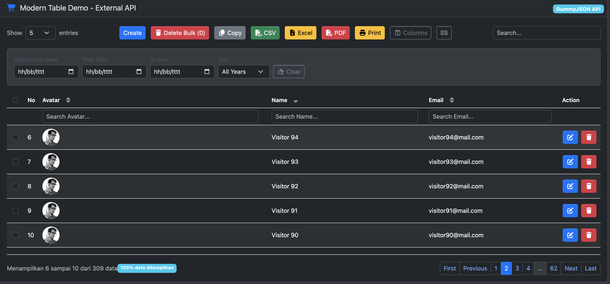
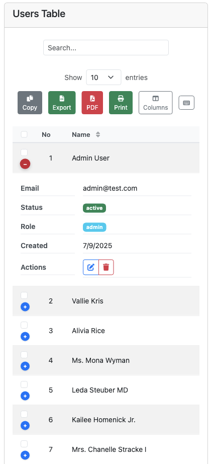

# 📸 ModernTable.js Screenshots

## 🖥️ Desktop Views

### With Bootstrap + Font Awesome

*Professional UI with Bootstrap styling and Font Awesome icons*

### Standalone (Zero Dependencies)

*Clean styling without any external dependencies*

### Dark Theme

*Built-in dark theme support*

## 📱 Mobile Views

### Responsive Design

*Smart responsive layout adapting to mobile devices*

### Mobile Toolbar

*Optimized button layout for touch devices*

---

## 📋 Additional Screenshots (Coming Soon)

- **Export Buttons** - Export functionality demonstration
- **Column Visibility** - Interactive column toggle
- **Search & Filters** - Advanced filtering options
- **Row Selection** - Multi-select functionality

---

## 📝 Screenshot Guidelines

### For Contributors

When adding new features, please include screenshots showing:

1. **Desktop view** (1200px+ width)
2. **Mobile view** (< 768px width)
3. **With Bootstrap** (if UI-related)
4. **Standalone mode** (if styling-related)
5. **Before/after** (if changing existing features)

### File Naming Convention

- `desktop-[feature].png` - Desktop screenshots
- `mobile-[feature].png` - Mobile screenshots
- `comparison-[feature].png` - Before/after comparisons
- `integration-[framework].png` - Framework integrations

### Image Specifications

- **Format**: PNG (for UI) or JPG (for photos)
- **Desktop**: 1200x800px recommended
- **Mobile**: 375x667px (iPhone size)
- **Quality**: High resolution, clear text
- **File size**: < 500KB per image
