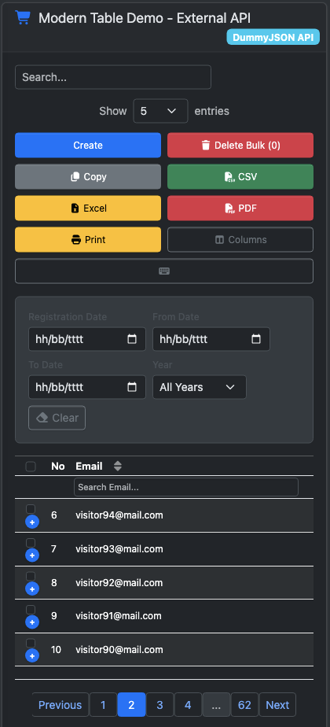

# Screenshots

Visual documentation of ModernTable.js features and themes.

## Desktop Views

### Bootstrap Integration

*ModernTable.js with Bootstrap 5 styling - full desktop layout with all features visible*

### Dark Theme

*Dark theme implementation - professional dark mode with proper contrast*

### Standalone Mode

*Zero-dependency mode - pure CSS styling without external frameworks*

## Mobile Views

### Responsive Design

*Mobile-first responsive design - columns automatically hide based on priority*

### Mobile Toolbar

*Mobile toolbar layout - optimized button arrangement for touch devices*

### Mobile Dark Theme

*Dark theme on mobile - consistent dark mode experience across all devices*

## Features Showcase

### Key Features Visible in Screenshots:

**Desktop Features:**
- ✅ Full column visibility
- ✅ Advanced toolbar with all buttons
- ✅ Search and filter panels
- ✅ Pagination controls
- ✅ Column sorting indicators
- ✅ Selection checkboxes
- ✅ Export buttons (Copy, CSV, Excel, PDF)
- ✅ Column visibility toggle

**Mobile Features:**
- ✅ Responsive column hiding
- ✅ Touch-friendly buttons
- ✅ Compact pagination
- ✅ Mobile-optimized search
- ✅ Expand/collapse details
- ✅ Simplified toolbar layout

**Theme Features:**
- ✅ Light/Dark theme support
- ✅ Auto theme detection
- ✅ Consistent styling across devices
- ✅ Bootstrap integration
- ✅ Standalone CSS fallbacks

## Browser Compatibility

Screenshots demonstrate compatibility across:
- ✅ Chrome 60+
- ✅ Firefox 55+
- ✅ Safari 12+
- ✅ Edge 79+

## Performance Indicators

Visual elements showing performance:
- ✅ Smooth animations
- ✅ Fast loading states
- ✅ Responsive interactions
- ✅ Clean rendering

## Accessibility Features

Visible accessibility elements:
- ✅ High contrast ratios
- ✅ Clear focus indicators
- ✅ Readable font sizes
- ✅ Touch-friendly targets
- ✅ Screen reader compatible markup